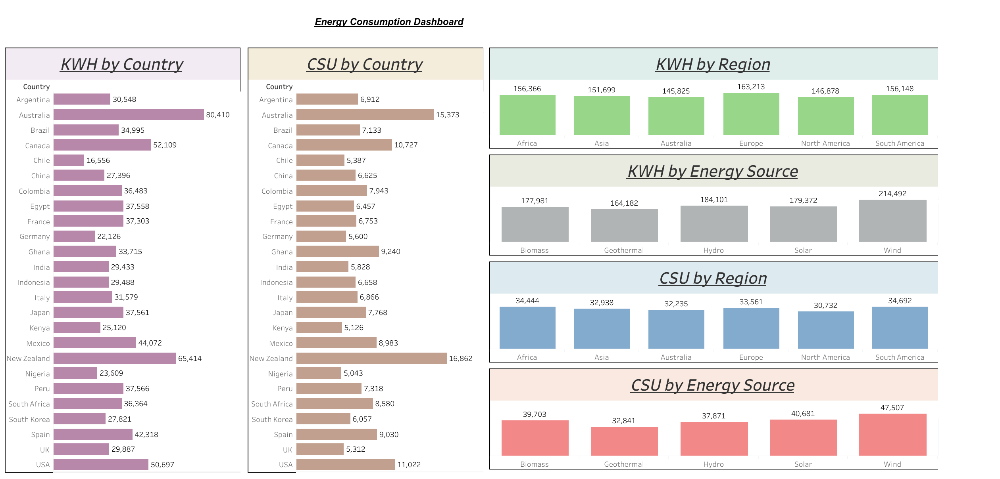

# ⚡ Energy Consumption Dashboard – Tableau + Snowflake + S3 Integration

This project demonstrates a full-stack BI solution that connects Amazon S3, Snowflake, and Tableau to visualize energy consumption trends. The final dashboard provides insights into regional and national energy usage, cost savings, and energy source effectiveness.

---

## 🌐 Project Summary

- **Title:** Energy Consumption Dashboard
- **Tools Used:** Amazon S3 · Snowflake · Tableau Cloud
- **Pipeline:** Amazon S3 ➝ Snowflake (SQL transformations) ➝ Tableau (Dashboard visualization)
- **Objective:** To understand global energy patterns and cost efficiency across regions, countries, and energy sources using a cloud-integrated BI pipeline.

---

## 🔁 Data Flow Pipeline

S3 (Raw CSV) ➝ Snowflake (SQL Cleanup & Modeling) ➝ Tableau (Interactive Dashboard)

---

### 🔹 Amazon S3
- Uploaded CSV file to S3 bucket
- Created and configured **IAM Role** with external ID for Snowflake access

### 🔹 Snowflake
- Set up **storage integration** and external stage
- Created structured table `energy_consumption`
- Applied SQL transformations (column creation, conditional updates using `CASE WHEN`, etc.)

### 🔹 Tableau
- Connected Snowflake as a live data source
- Designed interactive dashboard with calculated fields and filters
- Published to Tableau Cloud (see link below)

---

## 📊 Dashboard Overview

### 🔸 Title: **Energy Consumption Dashboard**



### Visual Insights:
- **KWH by Country:** Highlights highest and lowest consumers
- **Cost Savings (USD) by Country/Region:** Visual comparison of savings
- **KWH and CSU by Energy Source:** Compare renewable vs. non-renewable
- **Regional Comparisons:** Multi-panel views on energy adoption and efficiency

🔗 **Live Dashboard Link**  
👉 [View in Tableau Cloud](https://prod-apsoutheast-b.online.tableau.com/t/hritikmandlik63-2f9f664be6/views/Retail/Dashboard1)

---

## 📂 Dataset

The dataset used in this project is hosted publicly on Amazon S3.

📥 **Download CSV File (S3):**  
[Renewable_Energy_Usage_Sampled.csv](https://tableau1.projects.s3.amazonaws.com/Renewable_Energy_Usage_Sampled.csv)

This dataset contains:
- Household energy consumption by country and region
- Monthly usage in KWh
- Energy source type (renewable/non-renewable)
- Income level, household size, urban/rural classification
- Cost savings and energy adoption year

---

## ✅ Key Highlights

- ✅ End-to-end pipeline: S3 ➝ Snowflake ➝ Tableau
- ✅ Used `COPY INTO` to load data securely from S3 into Snowflake
- ✅ SQL transformations to model and clean data
- ✅ Interactive Tableau dashboard with real-time Snowflake connection
- ✅ Dashboard helps identify **most efficient energy sources**, **cost-saving trends**, and **regional consumption patterns**

---

## 📁 Repository Contents

```bash
tableau-energy-consumption-dashboard/
│
├── assets/
│   └── Dashboard_1.png                  # Dashboard screenshot
│
├── workbook/
│   └── Energy_Consumption_Dashboard.twb # Tableau workbook (no embedded data)
│
├── sql/
│   └── energy_consumption_etl.sql       # Snowflake transformation scripts
│
├── README.md                            # Project overview (this file)
└── LICENSE                              # MIT License
